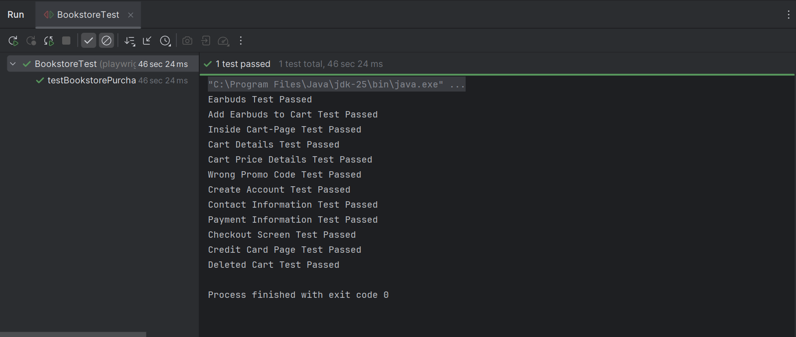
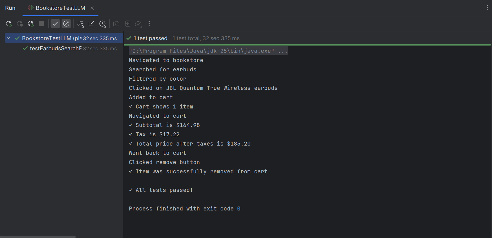

UI Testing Assignment - Sanam Choudhary

Videos of my tests in action are in the videos directory
of this project. Please right-click the video, choose Open in,
and select Explorer. Then you can open the video as a .webm.

Please run mvn clean before starting each test.

GITHUB: https://github.com/SanamChoudhary/Assignment6 

Reflection:

When I manually wrote UI tests using Java and Playwright, I felt a high level of 
control over every interaction and assertion. I had to think through each step 
of the user flow like locating elements, choosing selectors, deciding when to 
wait for a page to load, and writing assertions to verify results. While this 
took time, it helped me understand Playwright’s API and how the browser 
automation actually worked. Running the tests was straightforward because I
knew exactly what the script was doing and why. If something broke or a test 
failed, I could debug it more easily since I was familiar with the logic, 
rather than blindly trusting an AI.

Using AI-assisted UI testing through the MCP agent was a very different 
experience. Instead of manually writing each line of code, I simply described 
the behavior I wanted to test, and the agent generated Playwright code for me. 
This sped up the initial creation of test files by a huge margin. It was 
convenient not having to look up syntax or selector functions because the agent
produced working code within seconds. However, the accuracy of the generated 
tests varied. Sometimes the selectors the AI chose weren’t specific enough and
other times, the AI assumed different UI layouts than what actually existed, 
meaning I had to revise and debug the generated code anyway.

In terms of maintenance, manually written tests provided better long-term 
stability. Because I structured the tests myself, I knew how to update 
selectors or fix logic when the UI changed. AI-generated tests required more
maintenance because I didn’t write the code so I had to take a lot more time
in simply trying to understand the logic that the AI machine used. However, 
the agent was very useful when I needed to add additional test scenarios 
quickly. It worked best as a starting point rather than a final product.

Ultimately, both approaches have value. Manual testing gave me deeper 
understanding, precise control, and reliable tests, while AI-assisted testing 
made the initial development process much faster and made it easy to generate 
multiple test variations quickly. The biggest limitation of AI-assisted tests 
was that they sometimes lacked context about the UI and required human 
intervention to fine-tune selectors and assertions. This experience showed me 
that AI can significantly improve productivity in UI testing, but it works best 
when paired with human oversight and technical knowledge.
